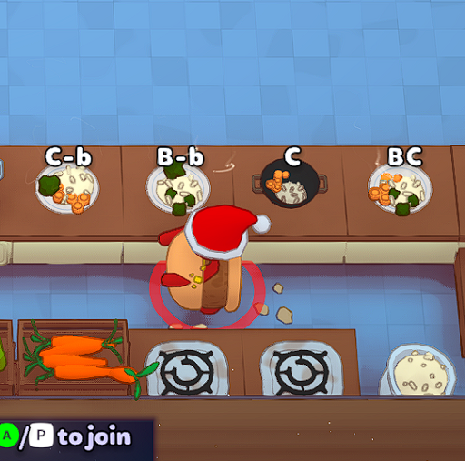
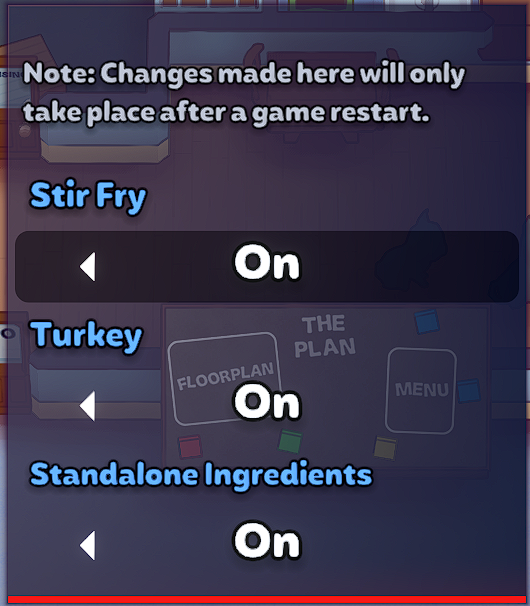

# Colorblind+

Adds colorblind labels to:
* Stir Fry, using the familiar B/C/Me labels. Sides of broccoli are displayed as "-b", to differentiate.
* Turkey + sides
* Burgers
* Pizza
* Salad
* Chopped onion, broccoli, carrots, mushroom, cheese, olive, lettuce (when standalone)

Additionally, reorders the ice cream bowl labels (CSV) to be consistent with the appliance (SCV).

Note: The title screen will not reflect the new labels.

A menu has been added to allow turning off meals that might be unnecessary for you. Accessible through the Mod Preferences menu. The default for all is currently "On".

Note: Since the labels are injected when the game loads, the game will need restarted before seeing these changes take place.

# Technical details

## How colorblind labels work

This is mostly in case I forget, but:

### Dishes/ItemGroupViews
* `ItemGroupView`s have two relevant properties:
    * `List<ColourBlindLabel> ComponentLabels` - list that gets loaded mysteriously, with `Item`s and their one or two letter abbreviations, storing the letter abbreviations for each component in the dish
    * `TextMeshPro ColourblindLabel` object, which is what displays the text. This seemingly only set when the dish has colorblind support built into the game, and is null for ItemGroupViews not supported in game.
* Additionally, the prefab of the `Item` that needs color blind support need a `Colour Blind` child containing a TextMeshPro. Not all Items have this.

This mod works by:
1. Taking the existing `Colour Blind` child from Pie
2. Cloning that child and adding it to an `Item`
3. Grabbing the `TextMeshPro` out of the cloned `Colour Blind` and setting it on the `Item`'s `ItemGroupView.ColourblindLabel`
4. Setting the `ItemGroupView.ComponentLabels` property with a custom list of Items/abbreviations

### Standalone ingredients
Additionally, some `Item`s, like Onions, just exist as `Item`s, and not in an item group. These do not seem to have `Colour Blind` labels at all, but they are also a single Item, so the solution is simply:
1. Clone a `Colour Blind` child from Pie into the Item's prefab, and set the `text` property to desired label

Thankfully, the game's on/off feature for colour blind labels seems to turn these on/off just the same.
